# 软件设计师（中级）UML 图专项讲义

## U1 UML 的 14 种图与分类

UML 2.x 共有 14 种图，分为结构图和行为图两大类。结构图描述系统的静态结构，包括类图、对象图、构件图、组合结构图、包图、部署图和轮廓图共 7 种；行为图描述系统的动态行为，包括用例图、活动图、状态机图和交互图共 4 类，交互图又包括顺序图、通信图、交互概览图和时序图。因此 14 种图是 7 种结构图，加上用例图、活动图、状态机图 3 种行为图，再加上 4 种交互图。顺序图和通信图合称交互图，二者语义等价，可以相互转换；顺序图强调消息的时间顺序，通信图强调对象之间的结构关系。

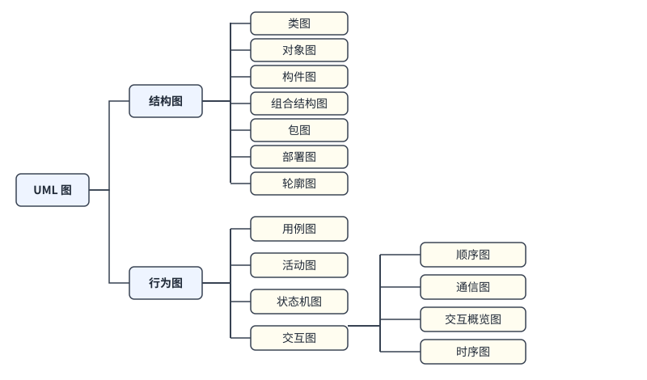

## U2 UML 的 4+1 视图

UML 的 4+1 视图包括逻辑视图、进程视图、实现视图、部署视图和用例视图。用例视图是核心，驱动其他四个视图，描述系统的功能需求。逻辑视图描述系统的静态结构与行为，常用类图、对象图和状态图表示；实现视图描述软件的物理组织，用构件图表示；部署视图描述软件在硬件上的分布，用部署图表示；进程视图描述系统的并发与同步。

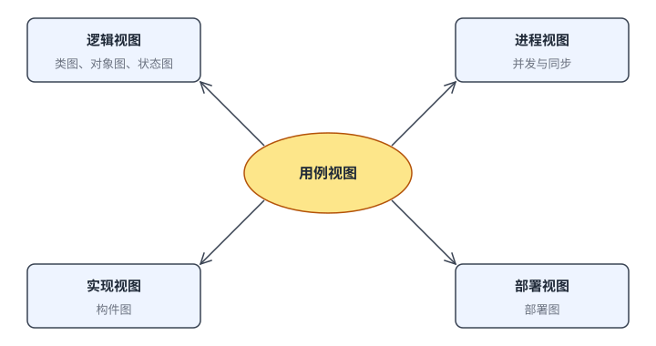

## U3 类的表示：三层结构与可见性

类用矩形分三层表示，从上到下依次是类名、属性和方法。属性和方法前的符号表示可见性：加号表示公有，减号表示私有，井号表示受保护，波浪号表示包内可见。抽象类的类名用斜体表示，抽象方法也用斜体表示。接口用矩形表示，在名称上方标注构造型 «interface»，只有名称和操作，没有属性。属性的完整写法是“可见性 名称: 类型”，方法的写法是“可见性 名称(参数): 返回类型”。

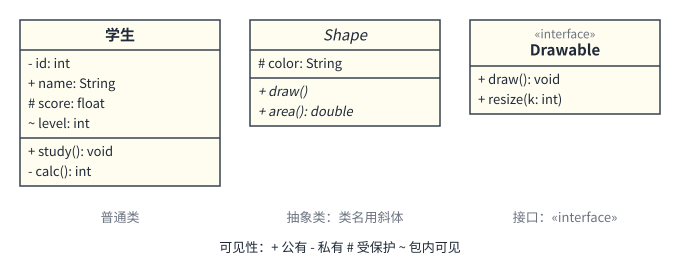

## U4 类图中的六种关系符号

类之间有依赖、关联、聚合、组合、泛化和实现六种关系。依赖用虚线加开口箭头，箭头指向被依赖的类；关联用实线，单向关联在被访问的一端加开口箭头；聚合用实线，在整体一端画空心菱形；组合用实线，在整体一端画实心菱形；泛化用实线加空心三角箭头，箭头指向父类；实现用虚线加空心三角箭头，箭头指向接口。判断时先看线型：实线带菱形的是聚合或组合，实线带空心三角的是泛化，虚线带空心三角的是实现，虚线带开口箭头的是依赖。

依赖：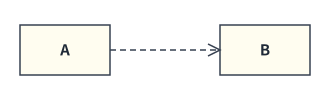

关联：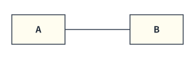

单向关联：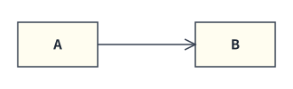

聚合：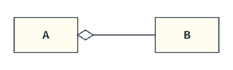

组合：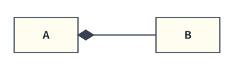

泛化：

实现：

## U5 关系辨析：依赖、关联、聚合与组合

关系从弱到强大致为依赖、关联、聚合、组合、泛化。依赖是临时的使用关系，一个类的方法把另一个类用作参数、局部变量或调用它的静态方法，但不长期持有它的引用。关联是类持有另一个类的引用，是长期的结构关系。聚合表示整体与部分的关系，部分可以脱离整体独立存在，例如院系与教师；组合是更强的聚合，部分不能脱离整体，整体消亡时部分随之消亡，例如汽车与发动机。聚合和组合的菱形都画在整体一端，而不是部分一端。在代码上，部分对象由外部传入的通常是聚合，由整体在内部创建的通常是组合。

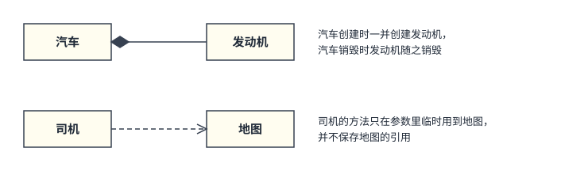

## U6 多重度

多重度写在关联线的两端，表示该端的类有多少个对象参与关联。1 表示恰好一个，0..1 表示零个或一个，0..* 表示零个或多个，1..* 表示至少一个，* 等价于 0..*，m..n 表示 m 到 n 个。多重度标在哪一端，就描述那一端的类有多少个对象与另一端的一个对象相关联。例如在顾客与订单的关联中，订单一端标 0..*，表示一位顾客可以有零个或多个订单；顾客一端标 1，表示一个订单只属于一位顾客。

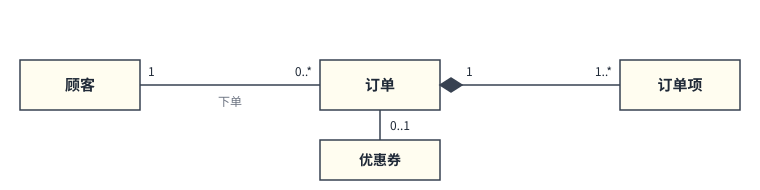

## U7 泛化、实现与综合读图

泛化表示“是一种”关系，子类继承父类的属性和方法，箭头由子类指向父类；一个类可以同时继承一个父类并实现多个接口。实现表示类实现接口声明的操作，箭头由实现类指向接口。读综合类图时先找出泛化与实现，再找组合与聚合，最后看关联和多重度。在学校类图中，学校与院系是组合关系，院系与教师是聚合关系，教师和学生都是人员的子类，教师与课程、学生与课程之间都是多对多的关联。

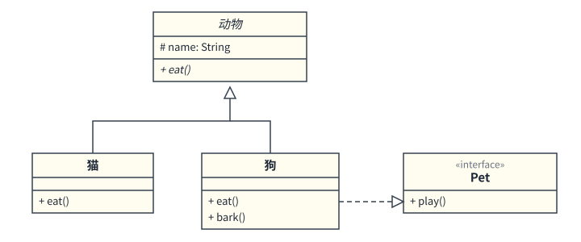

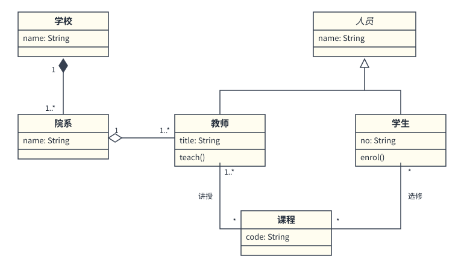

## U8 用例图的构成

用例图描述系统的功能需求，由参与者、用例、系统边界和它们之间的关系组成。参与者是系统外部与系统交互的人、设备或外部系统，用小人图形表示；用例是系统提供的一个完整功能，用椭圆表示；系统边界用矩形框表示，用例放在框内，参与者放在框外。参与者与用例之间是关联关系，用实线连接。参与者之间可以有泛化关系，子参与者继承父参与者的全部行为，箭头指向父参与者。

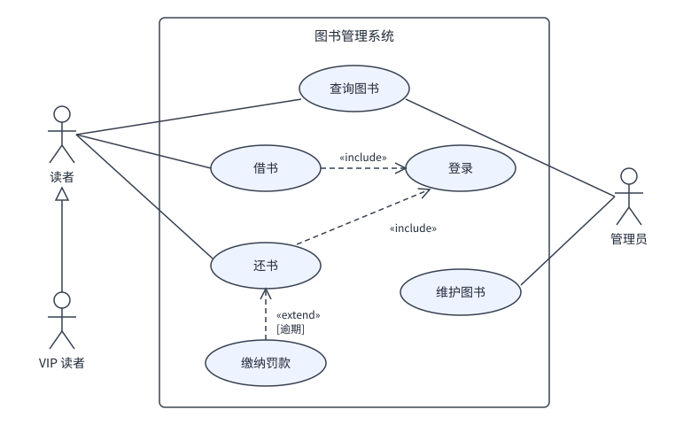

## U9 用例之间的关系

用例之间有包含、扩展和泛化三种关系。包含关系表示基用例的执行总会包含被包含用例，用带 «include» 的虚线箭头表示，箭头由基用例指向被包含用例，常用来抽取公共行为，例如借书和还书都包含登录。扩展关系表示在特定条件下基用例的行为才会被扩展用例增强，用带 «extend» 的虚线箭头表示，箭头由扩展用例指向基用例，扩展是可选的，例如还书逾期时才需要缴纳罚款。泛化关系用空心三角箭头的实线表示，箭头指向父用例。记忆方法：包含的箭头指向被包含者，扩展的箭头指向基用例。

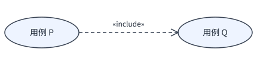

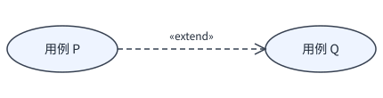

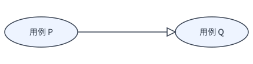

## U10 顺序图

顺序图强调对象之间消息传递的时间顺序。对象排在图的顶部，每个对象下方有一条垂直虚线叫生命线，时间自上而下流逝。生命线上的细长矩形是激活条，表示对象正在执行操作。同步消息用实线加实心三角箭头，返回消息用虚线加开口箭头，对象向自己发送的消息叫自消息，用折回到自己生命线的箭头表示。对象被销毁时在生命线末端画一个叉。组合片段用来表示分支和循环：alt 表示多个分支中选一个执行，条件写在方括号里，opt 表示可选执行，loop 表示循环。

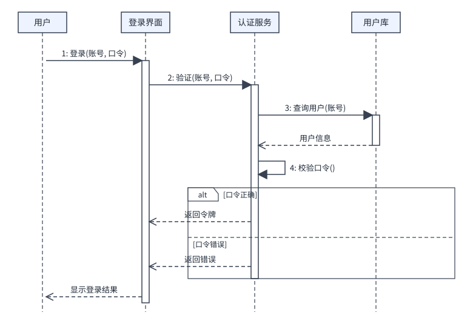

## U11 通信图与对象图

通信图强调参与交互的对象之间的结构关系，对象之间用实线表示链接，消息用靠近链接的带箭头短线表示，并带有顺序号，例如 1、1.1、2。顺序号体现消息的先后与嵌套，1.1 是 1 的嵌套调用。通信图与顺序图语义等价，可以相互转换，但通信图没有生命线和激活条。对象图是类图在某一时刻的实例快照，对象名带下划线，写法是“对象名 : 类名”，属性写成“属性 = 值”，对象之间的连线叫链接。

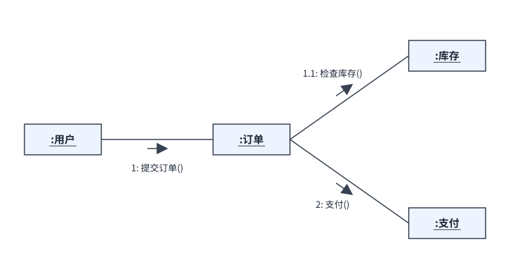

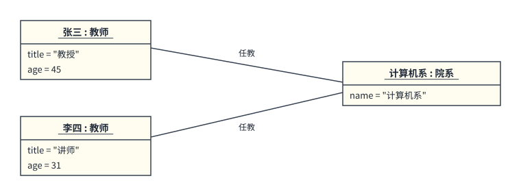

## U12 状态图

状态图也叫状态机图，描述单个对象在生命周期内的状态以及事件触发的状态转换。初始状态用实心圆表示，终止状态用外面带圆圈的实心圆表示，状态用圆角矩形表示，转换用带箭头的实线表示。转换上的标注格式为“事件 [监护条件] / 动作”，监护条件是方括号里的布尔表达式，条件为真时转换才会发生。状态图适合描述一个对象的行为，不适合描述多个对象的协作。

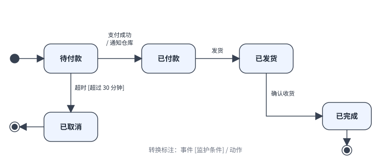

## U13 活动图

活动图描述业务流程或操作的控制流，适合表示并行流程。初始节点用实心圆表示，活动终止节点是外面带圆圈的实心圆，流终止节点是带叉的空心圆，只终止所在的那条流；判定节点用菱形表示，出边上写监护条件；分叉与汇合都用粗线表示，分叉把一条控制流拆成并行的多条，汇合要等所有并行流都到达后才继续。泳道把活动按负责者分区，每个泳道对应一个参与者或部门。

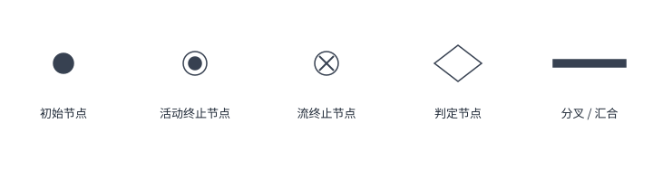

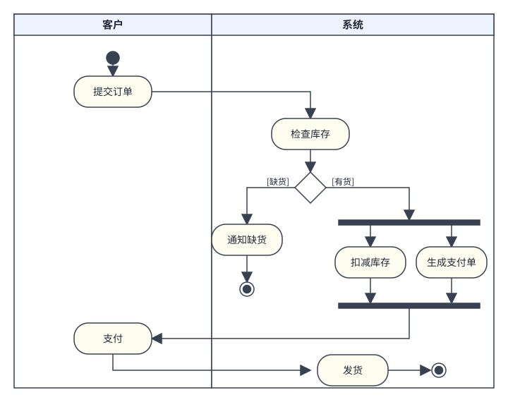

## U14 构件图、部署图与包图

构件图描述系统的物理构件及依赖关系，构件用带有两个小矩形的矩形表示。构件提供的接口用圆圈表示，需要的接口用半圆表示，半圆套住圆圈表示一个构件使用另一个构件的服务。部署图描述运行时的硬件节点以及构件在节点上的分布，节点用立方体表示，节点之间用实线表示通信路径，节点内放置制品。包图把模型元素组织成包，包用带标签页的文件夹形状表示，包之间用虚线箭头表示依赖关系，箭头指向被依赖的包。

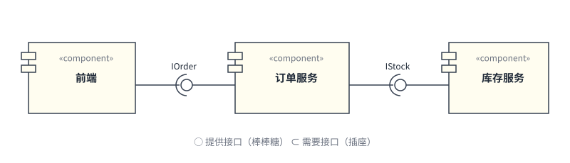

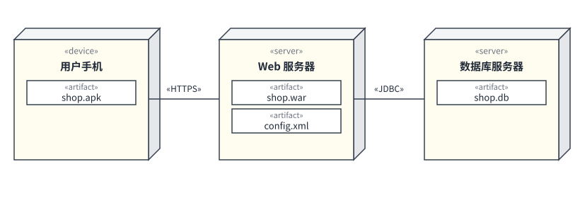

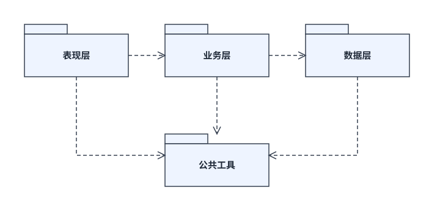

## U15 按需求选择合适的图

描述类及其静态关系用类图；描述系统有哪些功能以及谁来使用用例图；描述多个对象按时间顺序的交互用顺序图；描述单个对象的状态变化用状态图；描述业务流程与并行活动用活动图；描述软件的物理组织用构件图；描述软件在硬件上的分布用部署图；描述某一时刻的对象实例用对象图；描述模型元素的分组与依赖用包图。选图的依据是要表达的是静态结构还是动态行为，是单个对象还是多个对象的协作。
